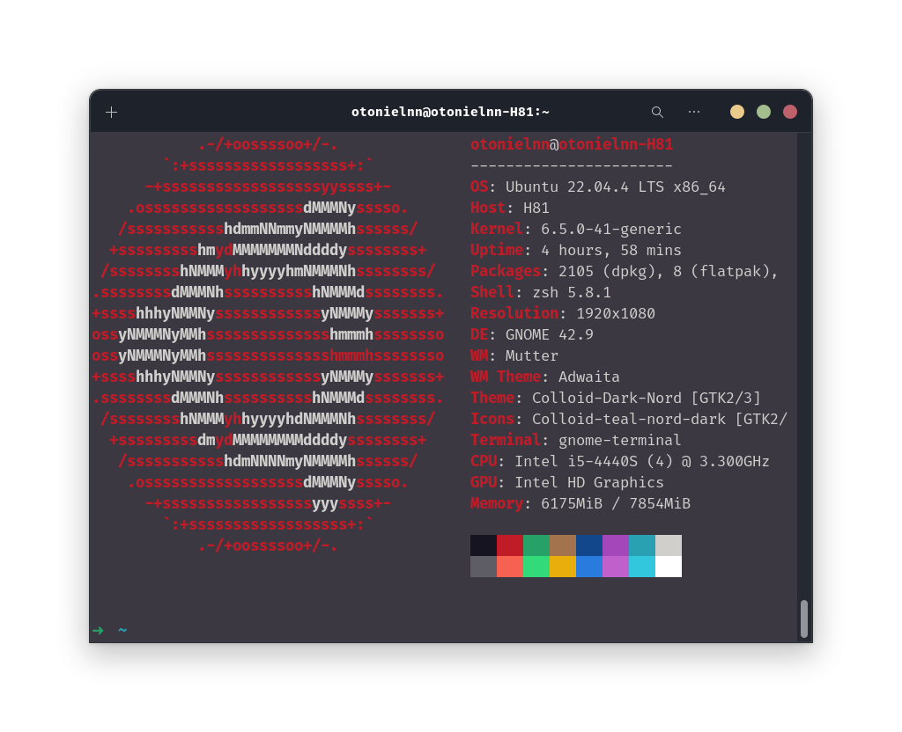
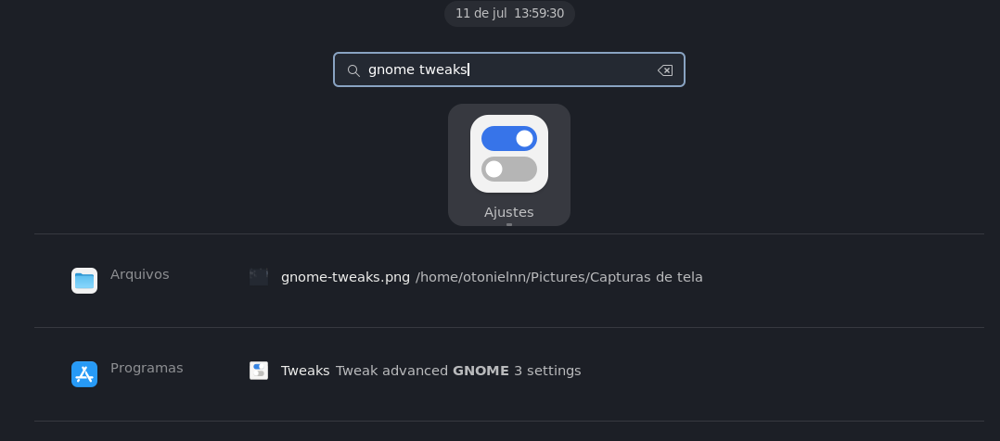
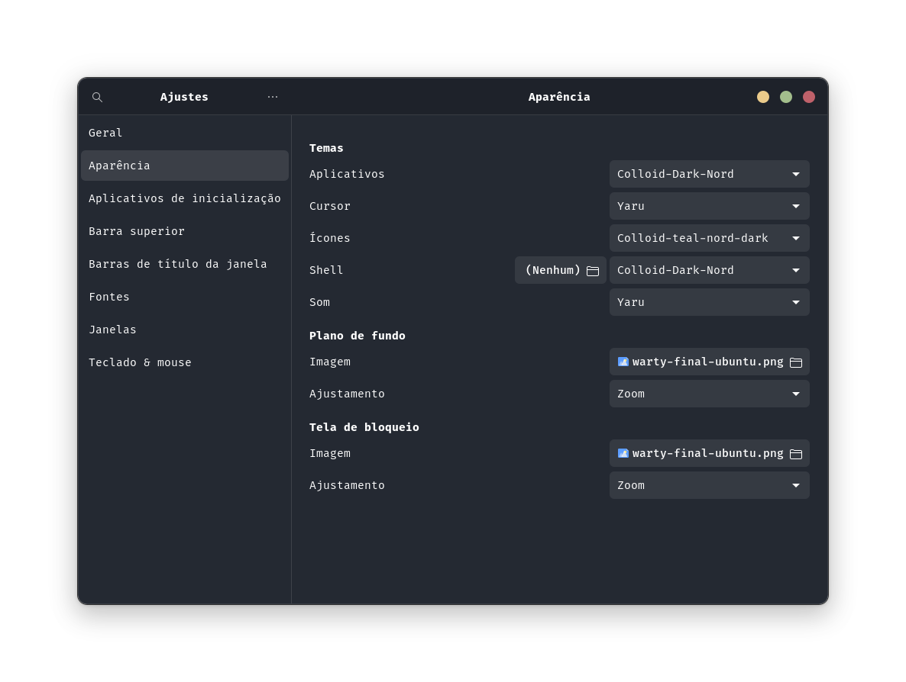
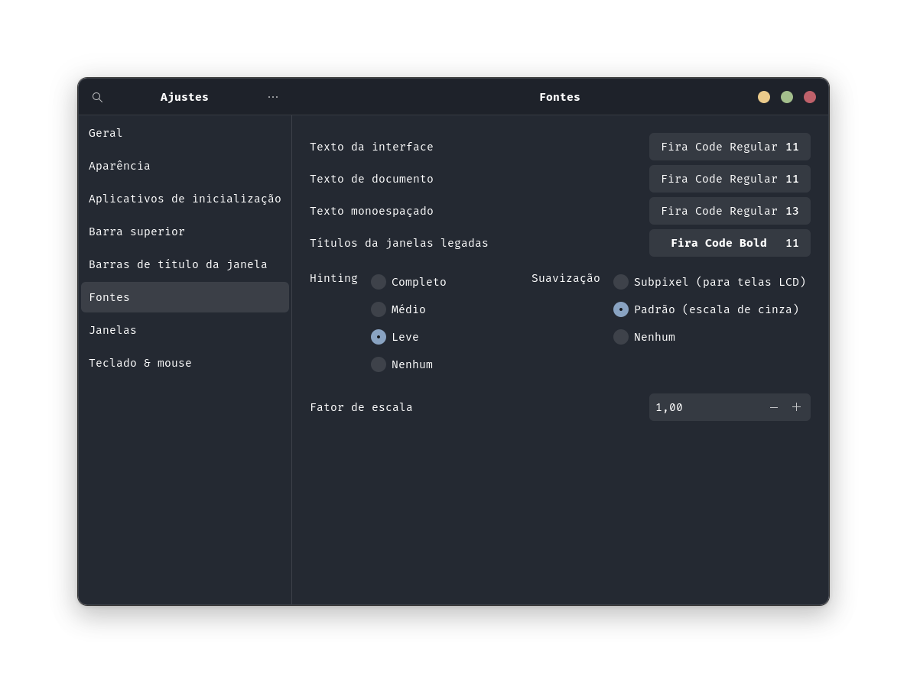

# My Linux Script Environment
This is my current OS and How is my workspace


## Shell
I'm currently using the `ZSH` with `Oh My Zsh`

### installation
- [ZSH](https://github.com/ohmyzsh/ohmyzsh/wiki/Installing-ZSH)
    ```bash
    sudo apt install zsh
    ```
- [Oh My Zsh](https://ohmyz.sh/)
    ```bash
    sh -c "$(curl -fsSL https://raw.githubusercontent.com/ohmyzsh/ohmyzsh/master/tools/install.sh)"
    ```
### Oh My Zsh plugins
- [fast-syntax-highlighting](https://github.com/zdharma/fast-syntax-highlighting)
    > syntax highlighting for commands typed interactively in the terminal
- [zsh-autosuggestions](https://github.com/zsh-users/zsh-autosuggestions)
    > It suggests commands as you type based on history and completions.

## GUI Personalization
First of all to change the theme on ubuntu we'll need to install `gnome-tweaks`.
```bash
sudo apt install gnome-tweaks
```
After that you can just search for **gnome tweaks** on the menu



### appearance

- Theme - [Colloid-gtk-theme](https://github.com/vinceliuice/Colloid-gtk-theme)
- Icone Theme - [Colloid-icon-theme](https://github.com/vinceliuice/Colloid-icon-theme)

### Font

- [Fira Code](https://github.com/tonsky/FiraCode)

## Script
### Tools
- `JDK`
- `VsCode`
- `Node`
- `Docker`
