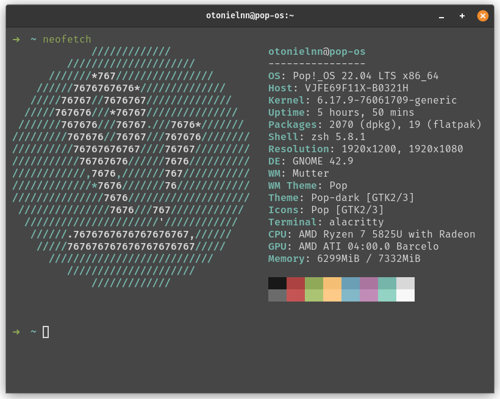
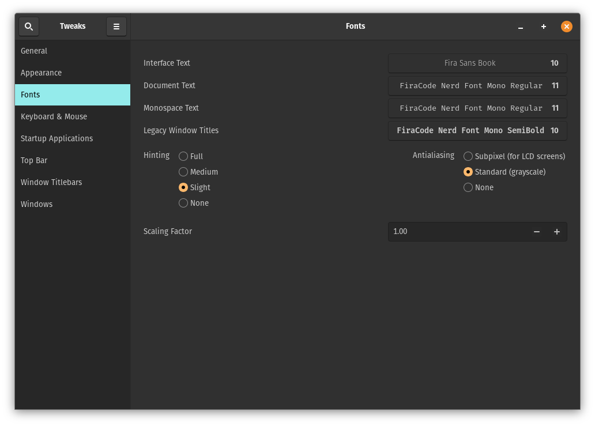

# My Linux WorkSpace 💻🧑🏽‍💻
This is my current OS and How is my workspace.


## Shell
I'm currently using the `Zsh` with `Oh My Zsh`

### installation
- [ZSH](https://github.com/ohmyzsh/ohmyzsh/wiki/Installing-ZSH)

    ```
    sudo apt install zsh -y
    ```
- [Oh My Zsh](https://ohmyz.sh/)

    ```
    sh -c "$(curl -fsSL https://raw.githubusercontent.com/ohmyzsh/ohmyzsh/master/tools/install.sh)"
    ```
### Oh My Zsh plugins
- [fast-syntax-highlighting](https://github.com/zdharma/fast-syntax-highlighting)

    > syntax highlighting for commands typed interactively in the terminal
- [zsh-autosuggestions](https://github.com/zsh-users/zsh-autosuggestions)

    > It suggests commands as you type based on history and completions.

## Terminal
Now I'm using [Alacritty](https://github.com/alacritty/alacritty).

### installation
You can install `Alacritty` following the official [guide](https://github.com/alacritty/alacritty/blob/master/INSTALL.md#prerequisites) on github.

Start clonning the Repo:

```
git clone https://github.com/alacritty/alacritty.git
cd alacritty
```

Run this command to install `rustup`:
```
curl --proto '=https' --tlsv1.2 -sSf https://sh.rustup.rs | sh
```

Then run this command to see if the rustup is installed:
```
rustup override stable
rustup update stable
```

Now run this command to install the minium dependencies required to build alacritty:

```
apt install cmake g++ pkg-config libfontconfig1-dev libxcb-xfixes0-dev libxkbcommon-dev python3
```

### Configuration
look the file `alacritty.toml`. This is the file with my Apperance config of alacritty. this file should stay at:
    ```
    ~/.config/alacritty/
    ```
## Apperance
Let's install `gnome-tweaks` to make some personalization on gnome.

```
sudo apt install gnome-tweaks -y
```

### Font

- [Fira Code Nerd](https://www.nerdfonts.com/font-downloads)

## Tools
- `Zsh` with `Oh My Zsh` and plugins.
- [Pyenv](https://github.com/pyenv/pyenv) - Manage python venvs.
    ```
    curl -fsSL https://pyenv.run | bash
    ```
- [SDKMAN](https://sdkman.io/) - Manage Java and Maven versions.
    ```
    curl -s "https://get.sdkman.io" | bash
    ```
- [VsCode](https://code.visualstudio.com/) - Code editor

    download the `.deb` then run:
    ```
    sudo dpkg -i [file name]
    ```
- [Chromium](https://flathub.org/en/apps/org.chromium.Chromium) (flatpak version) - Browser
    ```
    flatpak install flathub org.chromium.Chromium
    ```
- [Docker]()
    ```
    sudo apt install docker.io docker-compose -y
    ```
    Run this command to the service manager start the docker when the OS boot.

    ```
    sudo systemctl enable --now docker docker.socket containerd
    ```

    And then run this command to your user be able to run docker without `sudo`.

    ```
    sudo usermod -aG docker $USER
    ```